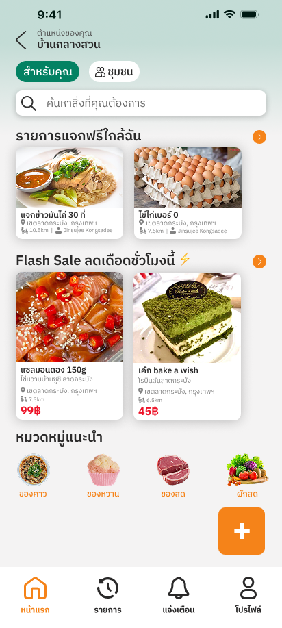
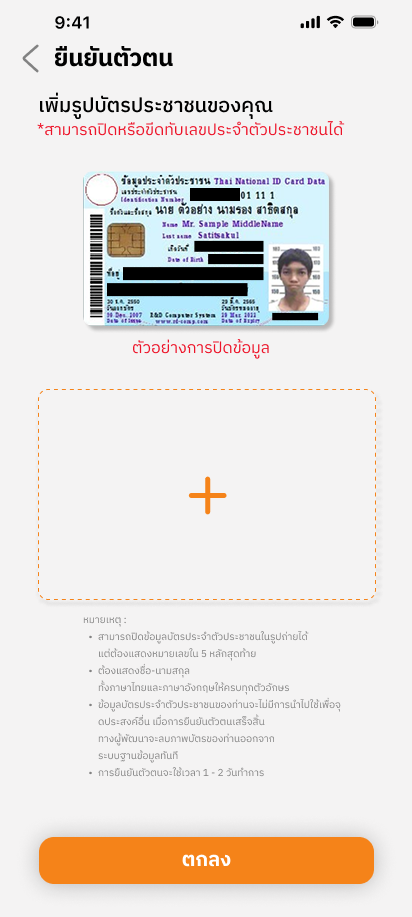
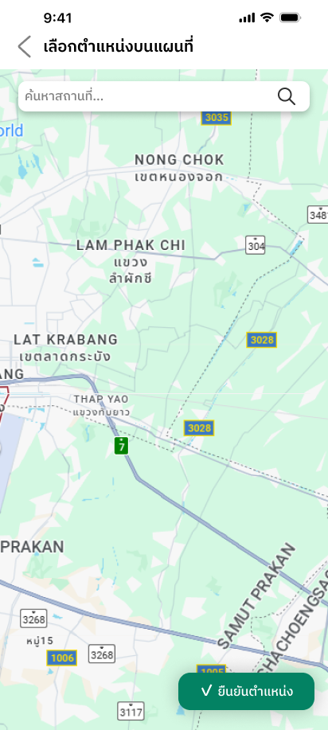
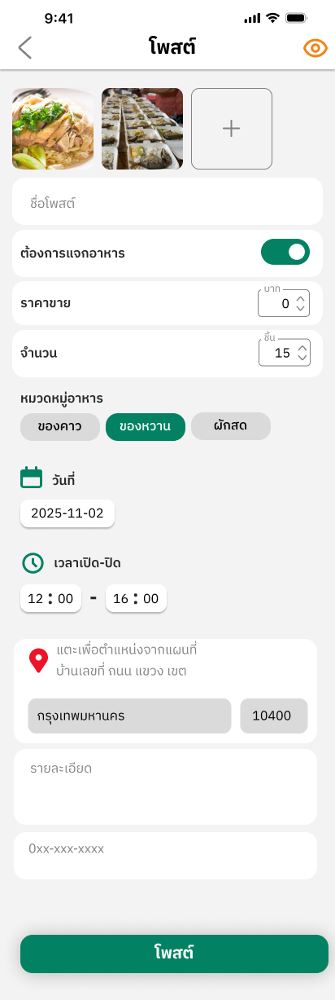

# FoodBridge 🍲🤝

A community food-sharing mobile application built with **Flutter** and **Golang**, designed to help people share **free food** and **discounted meals** within a community.  
The platform aims to reduce food waste while improving food accessibility.

---

## 🚀 Overview

FoodBridge allows users to post surplus food, browse available food near their location, and register to receive food within a specific time window.  
The application integrates location-based features, real-time availability tracking, and user interaction through a mobile-first experience.

---

## 🛠️ Tech Stack

| Layer        | Technology            |
|--------------|----------------------|
| Frontend     | Flutter (Dart)       |
| Backend      | Golang (Echo)        |
| API          | RESTful API          |
| Database     | PostgreSQL           |
| Map Service  | Google Maps API      |
| Deployment   | Docker               |

---

## ✨ Key Features

- User registration and profile management  
- Identity verification for trusted usage  
- Post free or discounted food with quantity and time availability  
- Location-based food discovery using map integration  
- Food reservation and status tracking (Open / Closed)  
- Community interaction through posts and comments  
- User activity summary (shared food, received food, savings)

---

## 📱 Application Screens (Selected)

### 🏠 Home Page

### 🔐 Identity Verification & Profile

### 📍 Location & Map Integration

### 📝 Create Food Post

### 📰 Food Detail

### 👤 User Profile & Activity

---

## 🧠 System Design Highlights

- Backend services implemented using **Golang (Echo)** with RESTful APIs  
- PostgreSQL used for managing users, food posts, reservations, and activity logs  
- Mobile frontend communicates with backend APIs for real-time updates  
- Map-based location selection and distance calculation for food discovery  
- Modular architecture separating UI, business logic, and data services  

---

## 🧪 Usage Flow

1. User registers and verifies identity  
2. User creates a food post (free or discounted) with location and time window  
3. Nearby users browse food posts via list or map view  
4. User registers to receive food  
5. Post status updates automatically based on availability  

---

## 📌 Notes

- This project focuses on community-driven food sharing, not commercial food delivery  
- All transactions are non-monetary or community-based  
- Designed as a fullstack academic project with real-world use cases  

---

## 🧑‍💻 Contributing

Contributions are welcome!  
Feel free to open issues or submit pull requests for improvements or new features.

---

## 🔗 Links

- GitHub Repository: https://github.com/17punchisama/FoodBridge

